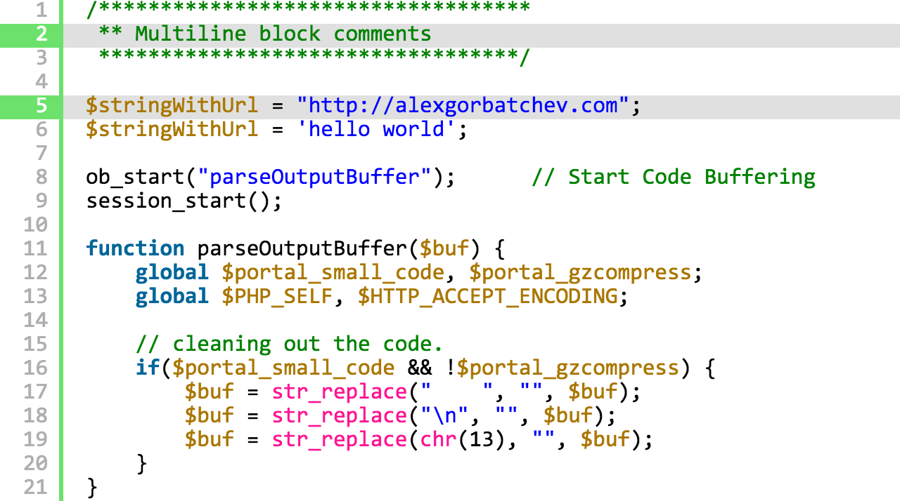

# SyntaxHighlighter v4

SyntaxHighlighter is THE client side highlighter for the web and web-apps! It's been around since 2004 and it's used virtually everywhere to seamlessly highlight code for presentation purposes.

The history of this project predates majority of the common web technologies and it has been a challenge to dedicate time and effort to keep it up to date. Everything used to be in one file and assign `window` variables... Horrors!

SyntaxHighlighter is currently used and has been used in the past by Microsoft, Apache, Mozilla, Yahoo, Wordpress, Bug Labs, Freshbooks and many many other companies and blogs.

## :zap: Reporting an issue? See [Filing Issues]. :zap:

## Get Started

* [Building] instructions
* [Usage] instructions
* Be sure to read the [Caveats]

## FAQ

* v4 is fully compatible with old brushes and themes, see [Building] instructions.
* The `?` was completely removed for cleaner, more seamless experience.
* You still have to HTML escape `<` when using `<pre/>` tags.

## Older Version

If you are looking for v3 documentation and download, you can find it on the [old site](alexgorbatchev.com/SyntaxHighlighter).

# License

MIT

[Filing Issues]: https://github.com/syntaxhighlighter/syntaxhighlighter/wiki/Filing-Issues
[Building]: https://github.com/syntaxhighlighter/syntaxhighlighter/wiki/Building
[Usage]: https://github.com/syntaxhighlighter/syntaxhighlighter/wiki/Usage
[Caveats]: https://github.com/syntaxhighlighter/syntaxhighlighter/wiki/Caveats
